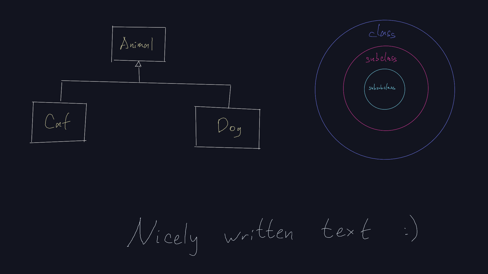

## Infinite Draw

A minimalistic drawing application

- [ ] *No distracting control boxes*
- [ ] Easy navigation
- [ ] Borderless canvas
- [ ] Drawing lines and circles
- [ ] Exporting as HTML
- [ ] Saving the result when the app is closed
- [ ] Both mouse and pen are supported

## Installation on Linux

To install the app on Linux via terminal, execute the following command with <kbd>pwd</kbd> set to the main directory. Assure that you have [CSFML](http://sfml-dev.org) 2.6.0 installed.

- <kbd>$ make</kbd>

## Usage

Execute:

- <kbd>$ ./cdraw [window width] [window height] [optional filename]</kbd>

#### Keyboard

- <kbd>0-9</kbd> Change the color
- <kbd>Z</kbd> Zoom in
- <kbd>X</kbd> Zoom out
- <kbd>.</kbd> Rotate clockwise
- <kbd>/</kbd> Rotate counterclockwise
- <kbd>Down</kbd> Undraw
- <kbd>Up</kbd> Redraw
- <kbd>Ctrl-E</kbd> Export as HTML
- <kbd>W</kbd> Toggle drawing lines
- <kbd>C</kbd> Toggle drawing circles
- <kbd>F</kbd> Switch to the default view
- <kbd>B</kbd> Zoom back to normal

#### Mouse

- <kbd>Left button</kbd> Draw
- <kbd>Middle button</kbd> Move the canvas
- <kbd>Scroll</kbd> Zoom in/out

## Created by Infinite Draw

[An example of a source file](demo/example.draw)

[A HTML file exported from the example](demo/example_exported.html)

